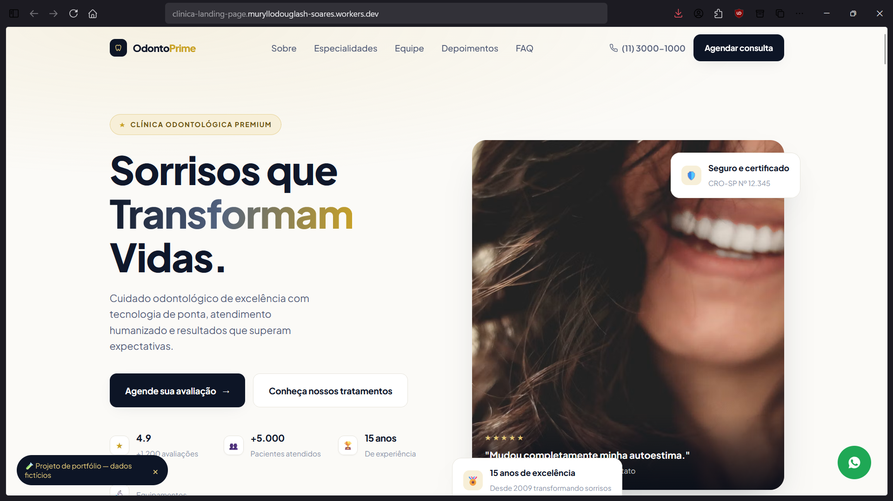
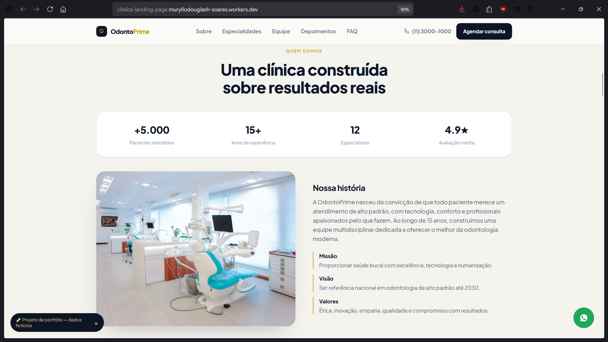
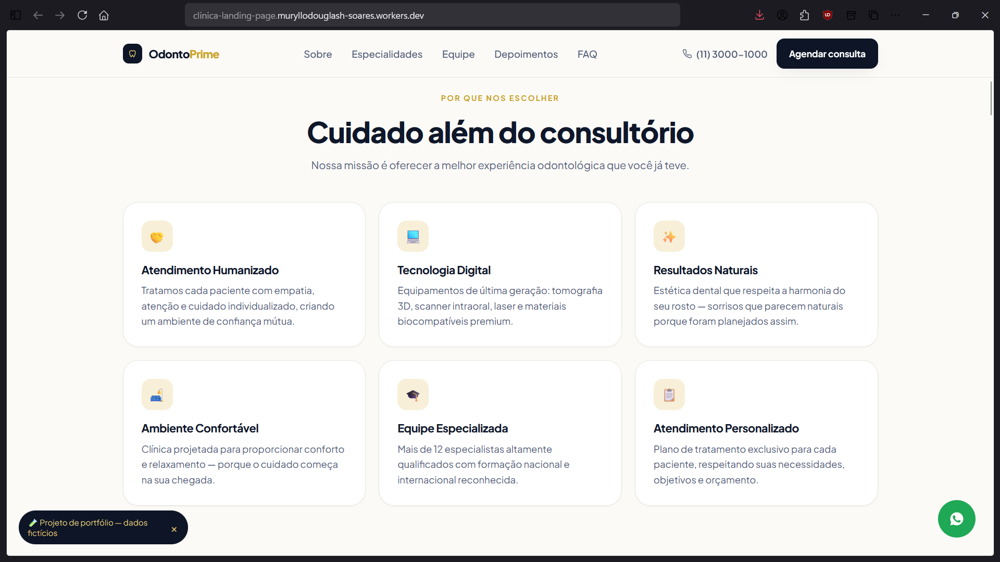
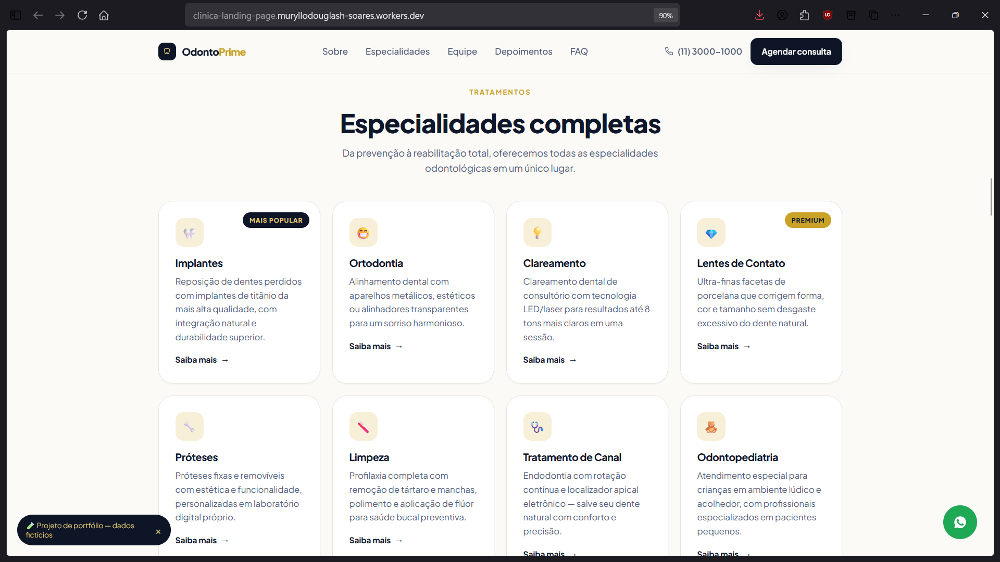
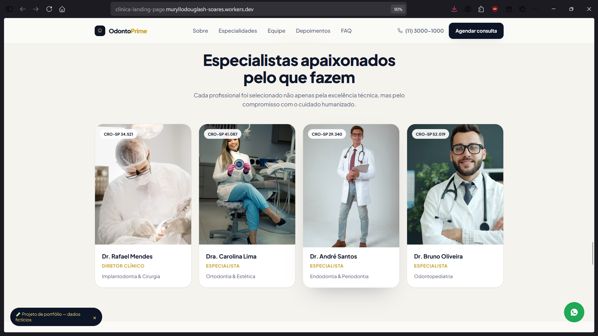
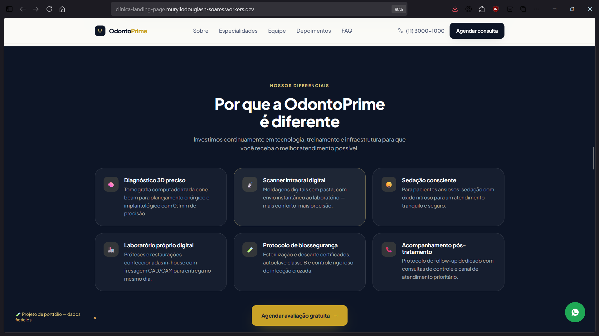
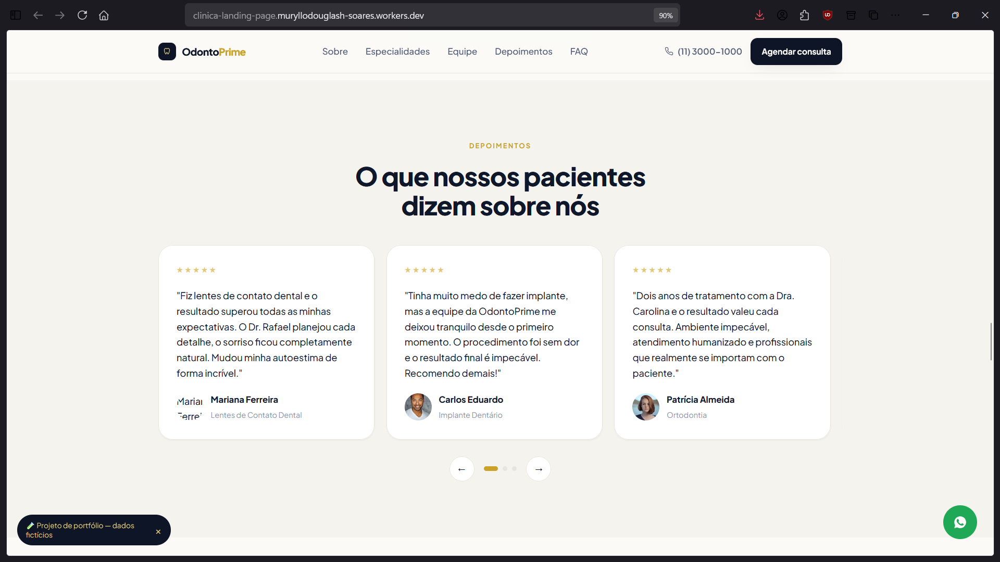
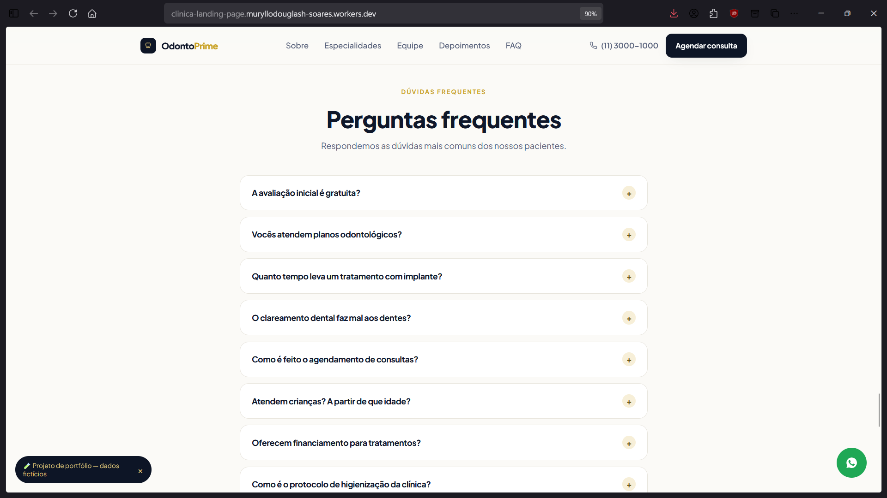
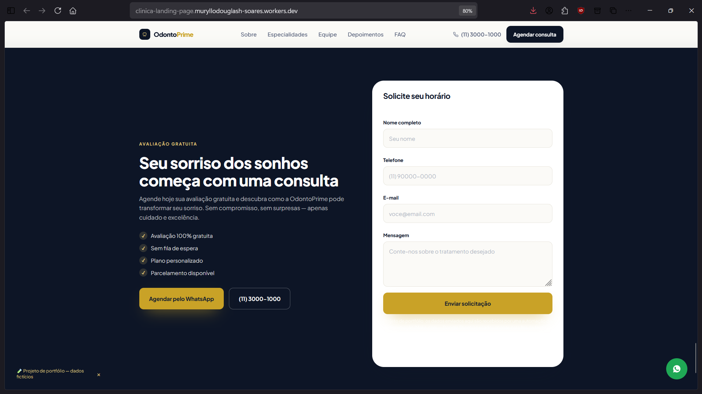
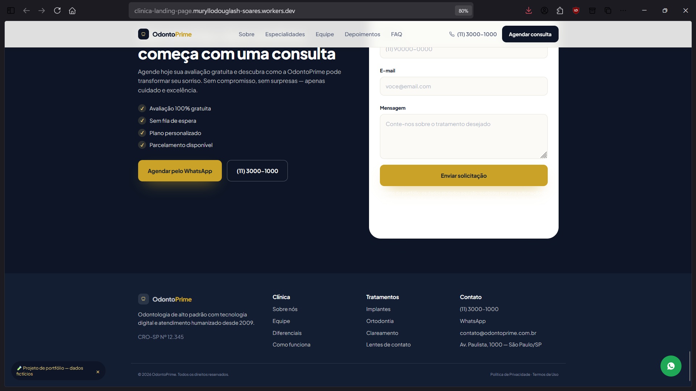

# OdontoPrime — Landing Page

> Landing page premium para uma clínica odontológica fictícia, com foco em performance, SEO e acessibilidade.

> ⚠️ **Projeto fictício de portfólio.** "OdontoPrime", os dentistas, depoimentos e números de registro (CRO-SP) são inventados. O formulário de contato está conectado a uma automação real (Make.com → Google Sheets) para fins de demonstração.

## 🌐 Demo

https://clinica-landing-page.muryllodouglash-soares.workers.dev

## 📸 Preview

<table>
  <tr>
    <td></td>
    <td></td>
  </tr>
  <tr>
    <td align="center"><sub>Página principal</sub></td>
    <td align="center"><sub>Quem somos</sub></td>
  </tr>
  <tr>
    <td></td>
    <td></td>
  </tr>
  <tr>
    <td align="center"><sub>Por que nos escolher</sub></td>
    <td align="center"><sub>Especialidades</sub></td>
  </tr>
  <tr>
    <td></td>
    <td></td>
  </tr>
  <tr>
    <td align="center"><sub>Equipe</sub></td>
    <td align="center"><sub>Diferenciais</sub></td>
  </tr>
  <tr>
    <td></td>
    <td></td>
  </tr>
  <tr>
    <td align="center"><sub>Depoimentos</sub></td>
    <td align="center"><sub>Perguntas frequentes</sub></td>
  </tr>
  <tr>
    <td></td>
    <td></td>
  </tr>
  <tr>
    <td align="center"><sub>Formulário de contato</sub></td>
    <td align="center"><sub>Rodapé</sub></td>
  </tr>
</table>

## Sobre o projeto

Landing page pixel-perfect construída a partir de um design de referência para uma clínica odontológica, servindo como peça de portfólio para demonstrar domínio de SSR, SEO técnico e integração de formulário com automação real (não apenas simulada).

## Funcionalidades

- [x] Landing page completa (serviços, equipe, depoimentos, FAQ) renderizada via SSR
- [x] Formulário de contato funcional, integrado a um webhook real (Make.com → Google Sheets), com modo demonstração automático caso o endpoint esteja vazio
- [x] Dados estruturados (JSON-LD) para `Dentist` e `FAQPage`
- [x] `sitemap.xml`, `robots.txt` e `manifest.json` (PWA) com ícones

## Tecnologias

### Frontend

- TanStack Start + TanStack Router (SSR e roteamento)
- React 19
- HTML/CSS/JS puro para o conteúdo da landing page em si (`public/odontoprime`), servido como conteúdo real da rota `/`
- Tailwind CSS + shadcn/ui (scaffold disponível para futuras telas internas)
- Vite

### Ferramentas

- ESLint + Prettier
- Bun (gerenciador de pacotes)

## Design e UX

O conteúdo da landing page em si (grades de serviços, equipe, depoimentos e FAQ) é montado dinamicamente via JavaScript no client (`public/odontoprime/js/script.js`), replicando o comportamento do design original de referência.

## Como executar

### Pré-requisitos

- Node.js
- Bun (ou npm/pnpm como alternativa)

### Instalação

```bash
git clone <URL-do-repositorio>
cd clinica-landing-page
bun install   # ou npm install / pnpm install
bun run dev    # ou npm run dev
```

Outros scripts disponíveis: `build`, `preview`, `lint`, `format`.

## Estrutura do projeto

```
public/odontoprime/       Landing page (HTML/CSS/JS) — o conteúdo real do site
  css/style.css
  js/script.js
  icons/
src/routes/index.tsx      Rota "/" — renderiza o HTML acima via SSR e injeta
                           metadados, JSON-LD e o script.js
src/routes/__root.tsx     Shell da aplicação (head padrão, favicon, manifest)
```

## Decisões técnicas

### Por que HTML/CSS/JS puro dentro de uma rota React?

O design foi construído como uma landing page estática (HTML/CSS/JS), mas o projeto usa TanStack Start para servir esse conteúdo via SSR na rota `/`, em vez de um redirecionamento client-side para um HTML solto em `/public`. Isso evita o duplo carregamento (bundle React + depois HTML estático) e garante que crawlers e previews de link (WhatsApp, Telegram etc.) recebam o conteúdo real da página, não uma tela de "carregando".

### Formulário de contato

O formulário (`#contactForm`) é validado e enviado via `fetch`, configurado para enviar os dados como `multipart/form-data` para um Custom Webhook do Make.com, que grava cada envio como uma nova linha em uma planilha do Google Sheets. Como o `fetch` roda no navegador do visitante, a URL do webhook fica visível no código-fonte — por isso ela não precisa (nem deveria) ser guardada como secret de plataforma, já que `script.js` é um asset estático fora do pipeline do Vite.

Outros destinos possíveis para o endpoint do formulário: Formspree, ou qualquer endpoint que aceite `POST` com `multipart/form-data`.

## SEO

- Dados estruturados (JSON-LD) para `Dentist` e `FAQPage` em `src/routes/index.tsx`
- `public/sitemap.xml` e `public/robots.txt` (referenciando o sitemap)
- `public/manifest.json` + ícones para instalação como PWA

> Antes de publicar, é necessário trocar a URL de exemplo (`https://odontoprime.exemplo.com.br`) pela URL real do deploy em `sitemap.xml`, `robots.txt` e no JSON-LD.

## Deploy

Publicado em Cloudflare Workers (conforme URL de demo).

## Autor

Muryllo Douglas

## Licença

MIT — ver [`LICENSE`](./LICENSE).
